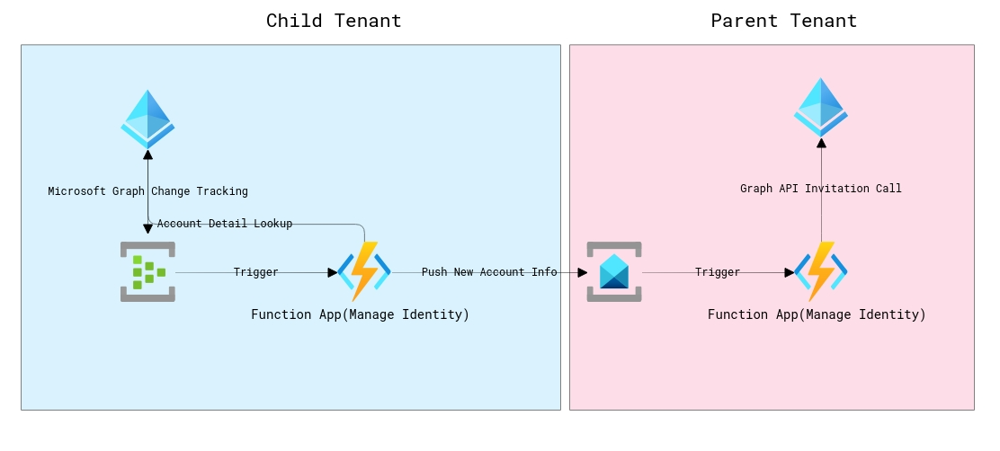

# Azure AD User Account Sync Across Tenants

## Overview
Azure AD has built in federation with other Azure AD tenants but in order for a user in one tenant to utilize resources in another tenanat, they must exist as Guest User Accounts in that Azure AD Tenant.  Azure AD's Graph API has a change notification service that you can subscribe to User Updates and Delete events.  

This repository demostrates how you can utlized the Graph API Change Feed to push user changes in one AAD tenant (Child) to another AAD tenanat (Parent)

## Design 


## Known Code Limitations
* I am not handling general user updates. I am treating all user updates as creation events since this is for demostration purposes only.
* I am not actually deleting the user in the parent domain. I am pushing the deletion event to Service Bus and then loging the event in the Parent AAD tenanat. That is left as an exercise.

# Infrastructure Setup

## Prerequisite
* [PowerShell 7](https://docs.microsoft.com/en-us/powershell/scripting/install/installing-powershell?view=powershell-7.1)
* [The Azure Function commandline tool](https://docs.microsoft.com/en-us/azure/azure-functions/functions-run-local?tabs=linux%2Ccsharp%2Cbash#v2)
* [The Azure cli](https://docs.microsoft.com/en-us/cli/azure/install-azure-cli-linux?pivots=apt)

## Parent Tenant 
```
$AppName = (New-Uuid).Substring(0,8)
./create_infrastructure_parent_tenant.ps1 -AppName $AppName -SubscriptionName "{{Subscription_in_Parent_Tenant}} -region centralus
```
## Child Tenant 
```
$sb = {{The Service Bus connection string output of script above}}
./create_infrastructure_child_tenant.ps1 -AppName $AppName -SubscriptionName "{{Subscription_in_Child_Tenant}} -ServiceBusConnectionString $sb -region centralus
```

# Code Deploy
## Parent Tenant 
```
cd source\parent_tenant
func azure functionapp publish ("func-{0}02" -f $AppName)
```

## Child Tenant 
```
cd source\child_tenant
func azure functionapp publish ("func-{0}01" -f $AppName)
```

# Validate 
* Create User in Child Tenant. Confirm that the user is created as a Guest Account in Parent Tenant
* Delete User in Child Tenant. Confirm that the user is removed from Parent Tenant
